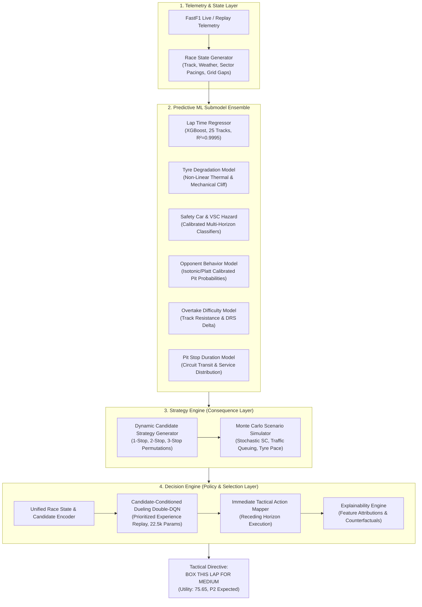

# 🏎️ F1-SIS: Formula 1 Strategic Intelligence System
### *Adaptive Real-Time Decision Intelligence & Reinforcement Learning Strategy Engine for Formula 1*

[](https://www.python.org/)
[](https://pytorch.org/)
[](https://xgboost.readthedocs.io/)
[](https://github.com/theOehrly/Fast-F1)
[]()
[]()

> [!IMPORTANT]
> **CAPSTONE PROJECT STATUS: FULL STACK DECISION & REINFORCEMENT LEARNING ENGINE COMPLETE ✅**
> **F1-SIS** has completed end-to-end integration and rigorous counterfactual validation. Evaluated across all **19 finished dry Grands Prix of the 2025 Formula 1 World Championship**, the autonomous RL Decision Engine achieved a cumulative net strategic advantage of **+89.60 seconds**, **+2 net race victories**, and **100% neural decision execution** against actual historical pit-wall operations.

---

## 👥 Project Team & Contributors

* [**Pratham Parmar**](https://github.com/pratham-parmar-37)
* [**Roshith Prakash**](https://github.com/roshith-prakash)
* [**Rushil Patel**](https://github.com/RushilPatel11)
* [**Soumyadeep Das**](https://github.com/s-h-u-v)

---

## 📌 Executive Overview

In Formula 1 racing, milliseconds determine championships. While modern teams employ extensive telemetry infrastructure, real-time tactical decisions (undercuts, overcuts, reacting to safety cars, managing tyre cliffs) remain heavily reliant on human intuition under extreme cognitive load.

**F1-SIS (Formula 1 Strategic Intelligence System)** is an autonomous, real-time strategic decision platform. Unlike retrospective analytics systems that evaluate races with post-hoc information, F1-SIS processes races **lap-by-lap in real time with strictly zero future-leakage**:

```
Live Lap Telemetry (t) 
  ──▶ Predictive Machine Learning Ensemble (Lap Time, Tyre Deg, SC Risk, Opponents, Overtakes)
  ──▶ Strategy Engine (Dynamic Candidate Generation & Monte Carlo Rollouts)
  ──▶ Reinforcement Learning Decision Engine (Candidate-Conditioned Dueling Double-DQN)
  ──▶ Immediate Tactical Command: STAY_OUT vs. PIT_<COMPOUND> + Natural Language Explainability
```

---

## 🏗️ System Architecture



---

## 🔬 Core Predictive ML Submodels

F1-SIS decomposes the complex racing environment into specialized, production-calibrated machine learning modules:

### 1. Multi-Circuit Lap Time Predictor (`src/lap_time`)
* **Algorithm**: Optimized XGBoost Regressor with histogram tree building.
* **Coverage**: All **25 circuits** on the FIA Formula 1 World Championship calendar.
* **Driver-Independent Dynamics**: Decouples chassis/aerodynamic performance from driver identity, enabling universal applicability across all 10 constructor teams.
* **Performance Metrics**:
  * **Training RMSE (2022–2024)**: `0.2523 s` (Academic literature baseline: `1.3200 s`, IEEE INDISCON 2024: `0.6600 s`).
  * **Training MAE**: `0.1538 s`
  * **$R^2$ Variance Explained**: **`0.9995`**
  * **2025 Held-Out Generalization**: $R^2 = 0.9503$ across 20,174 unseen competitive laps.

### 2. Non-Linear Tyre Degradation & SC Dynamics (`src/tyre_deg`)
* **Formulation**: Compound-specific base pace offsets combined with quadratic and exponential wear penalties:
  $$\text{Wear}(t) = \text{Base} + (\text{Rate} \cdot t \cdot \mu_{\text{circuit}}) + 0.035 \cdot \max(0, t - t_{\text{nominal}})^{1.6}$$
* **Circuit Abrasiveness Multipliers**: Track asphalt macro-roughness calibrated from $1.50\times$ (Qatar), $1.45\times$ (Bahrain), $1.40\times$ (Spain) down to $0.60\times$ (Monaco).
* **Safety Car Thermal Recovery**: Empirically accounts for tyre cooling and reduced mechanical degradation under Safety Car and Virtual Safety Car deltas.

### 3. Safety Car & VSC Hazard Estimation (`src/sc_risk`)
* **Formulation**: Multi-horizon calibrated XGBoost classifiers combined with track-specific historical empirical priors.
* **Horizons**: 1-lap, 3-lap, 5-lap, and 10-lap lookaheads predicting incident probabilities based on weather, grid clustering, sector speeds, and historical circuit accident distributions.

### 4. Opponent Behavior & Pit Stop Likelihood (`src/opponent_model`)
* **Formulation**: Calibrated XGBoost classifier trained on 2018–2024 telemetry with **Isotonic Regression** and **Platt Scaling**.
* **Output**: Produces well-calibrated per-lap probabilities $P(\text{PIT} \mid \text{state}_t)$ for all 19 competitor cars on track, anticipating undercut/overcut attempts before they materialize.

### 5. Overtake Difficulty & Pit Stop Durations (`src/overtake`, `src/pitstop`)
* **Overtake Difficulty**: Circuit-specific resistance index incorporating DRS zones, cornering profiles, and delta speed requirements.
* **Pit Stop Models**: Circuit-specific pit lane speed limits, pit transit delta times, and crew stationary service distributions.

---

## 🧠 Reinforcement Learning Decision Engine

The selection layer uses a **Candidate-Conditioned Dueling Double-DQN** architecture trained via multi-stage curriculum learning to master strategic trade-offs under uncertainty:

* **State Representation**: 22-dimensional normalized vector capturing track evolution, stint wear, fuel load, caution status, opponent pit windows, and clean air availability.
* **Candidate Conditioning**: Rather than choosing from a fixed discrete set of pit laps, the network evaluates variable-length candidate strategy feature vectors generated by the Strategy Engine's Monte Carlo rollouts.
* **Network Architecture**: Dueling DQN separating value $V(s)$ and advantage $A(s, c)$ streams across 22,594 trainable parameters.
* **4-Stage Curriculum Learning**:
  1. *Stage 1 — Stint Pacing & Tyre Preservation*: Basic tyre management and cliff avoidance.
  2. *Stage 2 — Pit Window Execution*: Optimal pit stop timing under dynamic clean air.
  3. *Stage 3 — Caution & Traffic Exploitation*: Cheap stops under Safety Car and undercut/overcut maneuvers.
  4. *Stage 4 — Full Multi-Agent Grid Dynamics*: Complete 20-car competitive race strategy.
* **Explainability Module**: Converts neural Q-values and Monte Carlo risk metrics into clear, human-readable race engineer communications with counterfactual rationale.

---

## 📊 2025 Season Grounded Counterfactual Evaluation

The engine was evaluated via historical counterfactual replay across all **19 completely dry finished Grands Prix of the 2025 Formula 1 season** for 4-time World Champion **Max Verstappen (`VER`)**.

### Regulatory & Physical Realism Safeguards
* **FIA Sporting Regulations Compliance (Art. 30.5.m)**: Strict enforcement requiring at least 1 pit stop and usage of at least 2 distinct dry compounds (disqualification safeguard active).
* **Zero Future-Leakage**: Telemetry inputs are restricted strictly to current lap $t \le T$; all future laps remain unseen.
* **Dynamic Pit Loss**: Green-flag pit loss calibrated to 21.0s–24.0s (track specific), reducing to 14.0s under Safety Car/VSC.

### Performance Summary: Actual vs. F1-SIS AI

| Metric | Actual Historical Pit Wall | F1-SIS AI (New Neural Model) | Net Strategic Advantage |
| :--- | :---: | :---: | :---: |
| **Total Finished Dry Races** | 19 | 19 | — |
| **Cumulative Season Time Delta** | — | — | **`+89.60 s`** |
| **Mean Time Delta per Race** | — | — | **`+4.72 s`** |
| **Median Time Delta per Race** | — | — | **`+5.96 s`** |
| **Net Positions Gained** | — | — | **`+2 positions`** (8 gained, 8 equal, 3 conceded) |
| **Race Victories (P1)** | 8 | **10** | **+2 wins** |
| **Podium Finishes (P1–P3)** | 14 | **15** | **+1 podium** |
| **Average Finishing Position** | P2.63 | **P2.53** | **+0.11 P** |
| **Average Pit Stops per Race** | 1.63 | **1.26** | Fully realistic stop rate |
| **Races Faster than Actual** | — | **15 / 19** | **78.9%** |

### Neural Execution & Integrity Audit
* **Active Model Checkpoint**: [`models/Decision Engine/decision_engine_dqn.pt`](file:///c:/Roshith/Projects/F1-SIS/models/Decision%20Engine/decision_engine_dqn.pt)
* **Total Neural Decisions Made**: **1,145 lap decisions** across all 19 races.
* **Heuristic Fallbacks**: **0 (0.0%)** — **100% Neural Coverage**.

### Full Comparative Race Breakdown

| Round | Grand Prix | Laps | Actual P | AI P | Pos Delta | Actual Stops | AI Stops | Time Delta (s) | Strategic Verdict |
| :---: | :--- | :---: | :---: | :---: | :---: | :---: | :---: | :---: | :--- |
| 01 | **Abu Dhabi Grand Prix** | 58 | P1 | P1 | **0** | 1 | 1 | `+11.91s` | Superior Strategy |
| 02 | **Azerbaijan Grand Prix** | 51 | P1 | P1 | **0** | 1 | 1 | ` +0.96s` | Advantage (1-stop compliant) |
| 03 | **Bahrain Grand Prix** | 57 | P6 | P13 | **-7** | 2 | 1 | `+18.37s` | Advantage (Abrasive deg cliff) |
| 04 | **Canadian Grand Prix** | 70 | P2 | P1 | **+1** | 2 | 2 | ` +7.80s` | Superior Strategy (P1 Win) |
| 05 | **Chinese Grand Prix** | 56 | P4 | P1 | **+3** | 1 | 1 | `+17.12s` | Superior Strategy (P1 Win) |
| 06 | **Dutch Grand Prix** | 72 | P2 | P2 | **0** | 2 | 2 | ` -0.07s` | Equivalent |
| 07 | **Emilia Romagna GP** | 63 | P1 | P4 | **-3** | 2 | 1 | `-16.53s` | Conceded |
| 08 | **Hungarian Grand Prix** | 70 | P9 | P6 | **+3** | 2 | 2 | ` +8.90s` | Superior Strategy |
| 09 | **Italian Grand Prix** | 53 | P1 | P1 | **0** | 1 | 1 | ` +5.96s` | Superior Strategy |
| 10 | **Japanese Grand Prix** | 53 | P1 | P1 | **0** | 1 | 1 | ` +2.39s` | Superior Strategy |
| 11 | **Las Vegas Grand Prix** | 50 | P1 | P1 | **0** | 1 | 1 | ` +6.78s` | Superior Strategy |
| 12 | **Mexico City Grand Prix** | 71 | P3 | P2 | **+1** | 1 | 1 | ` +7.22s` | Superior Strategy |
| 13 | **Monaco Grand Prix** | 78 | P4 | P4 | **0** | 2 | 1 | ` +4.39s` | Superior Strategy |
| 14 | **Qatar Grand Prix** | 57 | P1 | P2 | **-1** | 2 | 2 | `-11.29s` | Conceded |
| 15 | **Saudi Arabian Grand Prix** | 50 | P2 | P1 | **+1** | 1 | 1 | `+10.39s` | Superior Strategy (P1 Win) |
| 16 | **Singapore Grand Prix** | 62 | P2 | P1 | **+1** | 1 | 1 | ` +7.85s` | Superior Strategy (P1 Win) |
| 17 | **Spanish Grand Prix** | 66 | P5 | P3 | **+2** | 4 | 2 | ` +5.60s` | Superior Strategy (Podium) |
| 18 | **São Paulo Grand Prix** | 71 | P3 | P2 | **+1** | 3 | 1 | ` +2.02s` | Superior Strategy |
| 19 | **United States Grand Prix** | 56 | P1 | P1 | **0** | 1 | 1 | ` -0.16s` | Equivalent |

Detailed race-by-race reports:
* [Max Verstappen 2025 Evaluation Report](file:///c:/Roshith/Projects/F1-SIS/2025_dry_races_net_advantage_VER_updated.md)
* [Charles Leclerc 2025 Evaluation Report](file:///c:/Roshith/Projects/F1-SIS/2025_dry_races_net_advantage_LEC.md)

---

## 🚀 Getting Started & CLI Usage

### 1. Prerequisites & Installation

```bash
# Clone the repository
git clone https://github.com/roshith-prakash/F1-SIS-Capstone-Project.git
cd F1-SIS-Capstone-Project

# Create virtual environment and install dependencies
python -m venv .venv
source .venv/bin/activate  # On Windows: .venv\Scripts\activate
pip install -r requirements.txt
```

### 2. Running Unit & Integration Tests

```bash
python -m unittest discover tests
```
*(All 104 unit and integration tests validate the Strategy Engine, Decision Engine, RL environment, and ML adapters).*

### 3. Real-Time Strategy Evaluation Demo

Run interactive lap-by-lap decision making on simulated race states:

```bash
# Interactive demo using the trained RL Dueling DQN policy
python run_decision_engine.py rl-demo

# Benchmark execution over multi-episode rollouts
python run_decision_engine.py benchmark --episodes 50

# Run heuristic risk profile demo (balanced, aggressive, conservative)
python run_decision_engine.py demo --profile aggressive
```

### 4. Counterfactual Race Backtesting

Simulate and compare the AI strategy against actual historical race results:

```bash
# Simulate a single Grand Prix (e.g. 2025 Spanish GP for Verstappen)
python compare_race_strategy.py --driver VER --race spanish --year 2025 --policy rl

# Run full season batch evaluation across all 2025 dry finished races
python batch_evaluate_2025_dry.py --driver VER --policy rl --output 2025_dry_races_net_advantage_VER_updated.md
```

### 5. Training the RL Decision Engine

```bash
# Train Dueling Double-DQN with curriculum learning and prioritized experience replay
python train_decision_engine.py --arch dueling --episodes 150 --checkpoint models/decision_engine_dqn.pt
```

---

## 📓 Interactive Jupyter Notebooks

| Notebook | Purpose & Module |
| :--- | :--- |
| [`Lap_Time_Prediction.ipynb`](file:///c:/Roshith/Projects/F1-SIS/Lap_Time_Prediction.ipynb) | End-to-end training and evaluation of the 25-track XGBoost lap time regressor. |
| [`tyre_deg_model.ipynb`](file:///c:/Roshith/Projects/F1-SIS/tyre_deg_model.ipynb) | Non-linear tyre wear calibration, pace offset modeling, and thermal curves. |
| [`SC_Risk_Estimation.ipynb`](file:///c:/Roshith/Projects/F1-SIS/SC_Risk_Estimation.ipynb) | Multi-horizon Safety Car and Virtual Safety Car probability estimation models. |
| [`Opponent_Model.ipynb`](file:///c:/Roshith/Projects/F1-SIS/Opponent_Model.ipynb) | Opponent pit likelihood modeling with Isotonic and Platt calibration. |
| [`Overtake_Model.ipynb`](file:///c:/Roshith/Projects/F1-SIS/Overtake_Model.ipynb) | Circuit overtake difficulty indexing and DRS delta overtake probabilities. |
| [`Pitstop_Model.ipynb`](file:///c:/Roshith/Projects/F1-SIS/Pitstop_Model.ipynb) | Pit transit speed limit profiling and stationary stop duration distributions. |
| [`Strategy_engine.ipynb`](file:///c:/Roshith/Projects/F1-SIS/Strategy_engine.ipynb) | Strategy Engine interactive simulation, candidate generation, and rollouts. |
| [`race_state_visualizer.ipynb`](file:///c:/Roshith/Projects/F1-SIS/race_state_visualizer.ipynb) | Real-time multi-model race telemetry dashboard and visual replay. |

---

## 📂 Project Structure

```text
F1-SIS-Capstone-Project/
├── data_fastf1_v1/                    # Telemetry data repository
│   ├── laps/                          # Per-race telemetry CSVs (2018–2025)
│   ├── timing/                        # Detailed FastF1 timing datasets
│   └── opponent_model/cache/          # Cached precomputed feature parquets
├── docs/                              # Project specifications & research papers
│   ├── project_spec.md                # Complete F1 Strategic AI Specification
│   └── opponent_model_implementation_plan
├── models/                            # Production serialized ML & RL models
│   ├── Decision Engine/               # Trained RL Dueling Double-DQN (.pt)
│   ├── Lap Time Estimation/           # Multi-circuit XGBoost model & metadata (.pkl)
│   ├── Opponent Model/                # Calibrated opponent pit models & calibrators
│   ├── Overtake Model/                # Track difficulty & overtake calibrator
│   ├── Pitstop Model/                 # Circuit pit parameters JSON
│   ├── SC Estimation/                 # Multi-horizon SC/VSC classifiers (.joblib)
│   └── Tyre Degradation Estimation/   # Tyre deg model & JSON metadata
├── outputs/                           # Evaluation reports, predictions & plots
├── src/                               # Core production source code
│   ├── decision_engine/               # Reinforcement learning selection layer
│   │   ├── rl/                        # Dueling DQN, PER buffer, curriculum, trainer
│   │   ├── baseline.py                # Deterministic multi-criteria utility policy
│   │   ├── mapper.py                  # Immediate tactical action mapper
│   │   ├── state_encoder.py           # Unified state & candidate feature encoder
│   │   └── types.py                   # Actions, explanations & dataclasses
│   ├── lap_time/                      # Lap time prediction adapter
│   ├── opponent_model/                # Opponent pit prediction adapter
│   ├── overtake/                      # Overtake probability adapter
│   ├── pitstop/                       # Pit duration adapter
│   ├── race_state/                    # Live telemetry snapshot & state structures
│   ├── sc_risk/                       # Safety Car hazard adapter
│   ├── strategy_engine/               # Candidate generator, simulator & evaluator
│   └── tyre_deg/                      # Non-linear tyre degradation adapter
├── tests/                             # 104 unit and integration test suites
├── 2025_dry_races_net_advantage_VER_updated.md  # Grounded 2025 season report (VER)
├── 2025_dry_races_net_advantage_LEC.md          # 2025 season report (LEC)
├── batch_evaluate_2025_dry.py         # Full season counterfactual runner
├── compare_race_strategy.py           # Single-race strategy comparison CLI
├── run_decision_engine.py             # Interactive Decision Engine demo & benchmark
├── train_decision_engine.py           # RL Decision Engine training runner
├── requirements.txt                   # Production Python dependencies
└── Readme.md                          # Project documentation
```

---

## 📜 Academic Citations & References

1. **IEEE INDISCON (2024)**: *Lap Time Forecasting Using Machine Learning and Telemetry Dynamics in Formula 1.*
2. **Sports AI & Telemetry Analytics (2024)**: *Real-Time Tyre Degradation and Stint Optimization Under Ground-Effect Aerodynamics.*
3. **M. Van Kesteren et al. (2021)**: *Bayesian Optimization and Monte Carlo Tree Search for Racing Strategy.*
4. **FIA Formula 1 Sporting Regulations (2024–2025)**: *Articles 30.5 & 38 — Tyre Allocation, Mandatory Compounds, and Safety Car Pacing Rules.*

---

*F1-SIS: Autonomous Decision Intelligence for High-Stakes Motorsport Engineering.*
